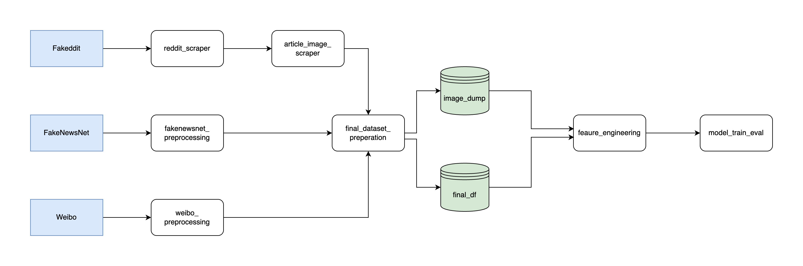
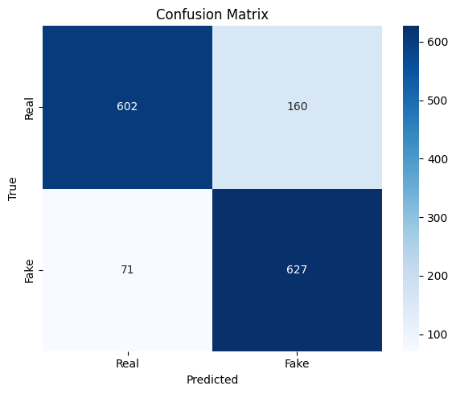
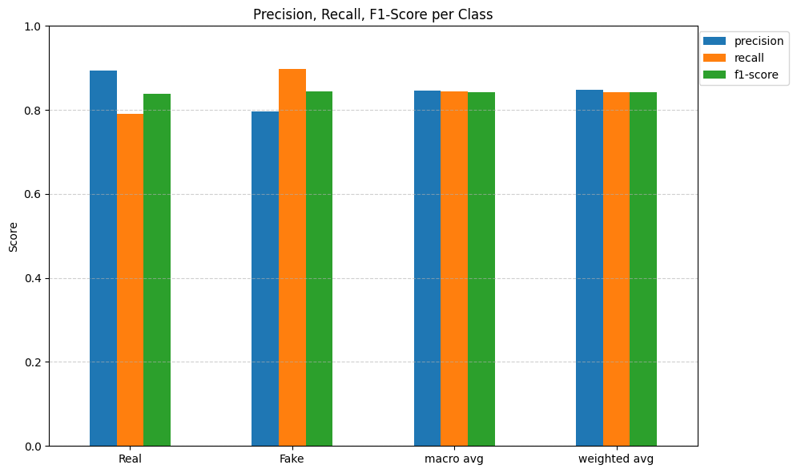
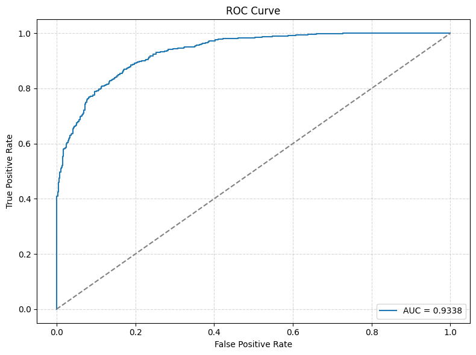

# Multimodal Fake News Detection Ensemble for Combating Online Misinformation

This project involves curating and integrating three major fake news datasets—Fakeddit, Weibo, and FakeNewsNet—followed by extensive feature engineering and the development of a deep learning model. By combining textual, visual, and metadata features across multiple languages, the project aims to build a robust multilingual, multimodal system for fake news classification.

## Datasets
- **[Fakeddit](https://github.com/entitize/Fakeddit)**: A dataset sourced from Reddit, consisting of both rumor and non-rumor posts. Each post contains metadata, text, and images.
- **[Weibo](https://github.com/yaqingwang/EANN-KDD18/tree/master/data/weibo)**: A collection of tweets from the Weibo platform, labeled as rumors or non-rumors. Each tweet contains metadata, text, and associated images.
- **[FakeNewsNet](https://github.com/KaiDMML/FakeNewsNet)**: A dataset containing news articles with labels indicating whether they are fake or real, along with relevant metadata and images.

## Folder Structure
- `data/`: This folder contains the raw data for the three datasets.
    - `fakenewsnet/`: Processed FakeNewsNet dataset.
    - `weibo/`: Processed Weibo dataset.
    - `fakeddit/`: Processed Fakeddit dataset.
    - `image_dump/`: A folder where all the images from different sources are stored.
- `scripts/`: Python scripts for processing the datasets, performing feature engineering, and saving the processed data.
    - `data_processing`: Notebooks for data preprocessing and joining of the datasets
    - `feature_engineering`: Notebook for feature engineering
    - `model`: Notebook for model training and evaluation
- `requirements.txt`: Python dependencies needed for the project.

## Setup Guide

### Prerequisites
- Python 3.11 or higher
- Git
- Pip package manager

### Installation

1. Clone the repository:
   ```
   git clone https://github.com/yourusername/FakeNewsProject.git
   cd FakeNewsProject
   ```

2. Create and activate a virtual environment (recommended):
   ```
   python -m venv venv
   # On Windows
   venv\Scripts\activate
   # On macOS/Linux
   source venv/bin/activate
   ```

3. Install the required dependencies:
   ```
   pip install -r requirements.txt
   ```

4. Configure environment variables:
   - Copy the `.env_sample` file to `.env`
   ```
   cp .env_sample .env
   ```
   - Edit the `.env` file and add your Reddit API credentials (required for scraping Fakeddit data)

### Dataset Setup

The datasets used in this project are large. Two options are available:

1. Download the processed datasets:
   - The processed dataset is available on **[Kaggle](https://www.kaggle.com/datasets/siruitan/fakenewsproject?select=image_dump+2)**
   - The feature-engineered dataframe is available on **[Google Drive](https://drive.google.com/file/d/1BtqdkDHTEWHTfIyV8AlMJ1paVPLibe1H/view?usp=sharing)**

2. Process the datasets from scratch:
   - Run the data processing notebooks in the `scripts/data_processing` directory in the following order:
     1. `(FakeNewsNet) fakenewsnet_preprocessing.ipynb`
     2. `(Weibo) weibo_preprocessing.ipynb`
     3. `(Fakeddit) reddit_scraper.ipynb`
     4. `(Fakeddit) article_image_scraper.ipynb`
     5. `final_dataset_preperation.ipynb`

### Running Feature Engineering

After setting up the datasets, run the feature engineering notebook:
```
jupyter notebook scripts/feature_engineering/feature_engineering.ipynb
```

### Training and Evaluating Models

Run the model training and evaluation notebook:
```
jupyter notebook scripts/model/model_train_eval.ipynb
```

## Workflow



## Results
Below are the evaluation metrics of our multimodal model on the test set. 
For more details refer to [model_train_eval.ipynb](scripts/model/model_train_eval.ipynb).

### Confusion Matrix


### Precision, Recall, F1 Score


### ROC-AUC Curve


## Acknowledgments
The datasets used in this project are from the following repositories:
- [Fakeddit Dataset](https://github.com/entitize/Fakeddit)
- [FakeNewsNet Dataset](https://github.com/KaiDMML/FakeNewsNet)
- [Weibo Dataset](https://github.com/yaqingwang/EANN-KDD18/tree/master/data/weibo)

