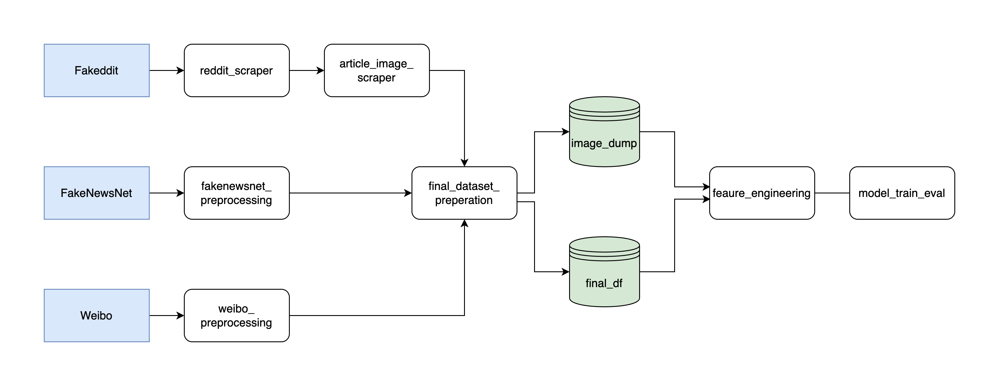

# Multimodal Fake News Detection Ensemble for Combating Online Misinformation

This project involves curating and integrating three major fake news datasets—Fakeddit, Weibo, and FakeNewsNet—followed by extensive feature engineering and the development of a deep learning model. By combining textual, visual, and metadata features across multiple languages, the project aims to build a robust multilingual, multimodal system for fake news classification.

## Datasets
- **[Fakeddit](https://github.com/entitize/Fakeddit)**: A dataset sourced from Reddit, consisting of both rumor and non-rumor posts. Each post contains metadata, text, and images.
- **[Weibo](https://github.com/yaqingwang/EANN-KDD18/tree/master/data/weibo)**: A collection of tweets from the Weibo platform, labeled as rumors or non-rumors. Each tweet contains metadata, text, and associated images.
- **[FakeNewsNet](https://github.com/KaiDMML/FakeNewsNet)**: A dataset containing news articles with labels indicating whether they are fake or real, along with relevant metadata and images.

## Folder Structure
- `data/`: This folder contains the raw data for the three datasets.
    - `fakenewsnet/`: Processed FakeNewsNet dataset.
    - `weibo/`: Processed Weibo dataset.
    - `fakeddit/`: Processed Fakeddit dataset.
    - `image_dump/`: A folder where all the images from different sources are stored.
- `scripts/`: Python scripts for processing the datasets, performing feature engineering, and saving the processed data.
    - `data_processing`: Notebooks for data preprocessing and joining of the datasets
    - `feature_engineering`: Notebook for feature engineering
    - `model`: Notebook for model training and evaluation
- `requirements.txt`: Python dependencies needed for the project.

## Workflow
We preprocessing each dataset using scripts in `scripts/data_processing`. 

The processed dataset is then saved on **[Kaggle](https://www.kaggle.com/datasets/siruitan/fakenewsproject?select=image_dump+2)**.

We then apply feature extraction using `scripts/feature_engineering.ipynb`, and the resulting dataframe is saved on **[Google Drive](https://drive.google.com/file/d/1BtqdkDHTEWHTfIyV8AlMJ1paVPLibe1H/view?usp=sharing)**

Finally, train our models using the notebook under `scripts/models/model_train_eval.ipynb`.

## Acknowledgments
The datasets used in this project are from the following repositories:
- [Fakeddit Dataset](https://github.com/entitize/Fakeddit)
- [FakeNewsNet Dataset](https://github.com/KaiDMML/FakeNewsNet)
- [Weibo Dataset](https://github.com/yaqingwang/EANN-KDD18/tree/master/data/weibo)

